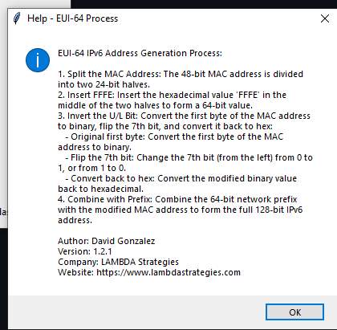
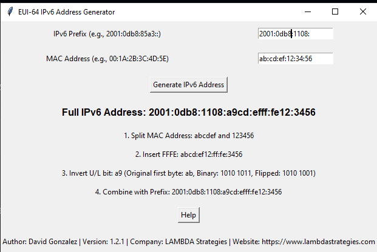

# EUI-64 IPv6 Address Generator

## Overview
This project provides a graphical user interface (GUI) tool for generating IPv6 addresses using the EUI-64 process. The tool allows users to input an IPv6 prefix and a MAC address, and it performs the EUI-64 process to produce the full IPv6 address. The GUI also explains the steps involved in the process.

## Features
- Input fields for IPv6 prefix and MAC address
- Step-by-step explanation of the EUI-64 process
- Help button providing detailed instructions
- Generates full IPv6 address based on user input
- Validates MAC address and IPv6 prefix format
- Provides a portable executable version with a custom icon

## Screenshots

<p align="center">
  
  <br>Main interface of the EUI-64 IPv6 Address Generator
</p>

<p align="center">
  
  <br>Detailed process explanation in the help screen
</p>

## Requirements
- Python 3.x
- Tkinter (if running from source)

## Installation

### Running from Source

1. Clone the repository:
    ```sh
    git clone https://github.com/davidgonzalezh/EUI64-IPv6-Generator.git
    ```
2. Navigate to the project directory:
    ```sh
    cd EUI64-IPv6-Generator
    ```

3. Run the Python script:
    ```sh
    python eui64_ipv6_generator_v1.2.1.py
    ```

### Creating the Portable Executable

1. Install PyInstaller:
    ```sh
    pip install pyinstaller
    ```

2. Build the Executable:
    ```sh
    pyinstaller --name EUI64IPv6Generator --onefile --noconsole --icon=icon.ico eui64_ipv6_generator_v1.2.1.py
    ```

   If `pyinstaller` is not recognized, use:
    ```sh
    python -m PyInstaller --name EUI64IPv6Generator --onefile --noconsole --icon=icon.ico eui64_ipv6_generator_v1.2.1.py
    ```

3. Find the executable in the `dist/` folder.

## Download Locations
You can download the portable executable directly from the following link:
- [Download EUI64IPv6Generator](https://github.com/davidgonzalezh/EUI64-IPv6-Generator/releases/latest)

## Usage
Run the executable file located in the `dist/` directory:
```sh
./dist/EUI64IPv6Generator
```
## Windows Defender SmartScreen Warning

You might encounter a SmartScreen warning when running the executable for the first time. This is because the app is unsigned.

## Why Does This Warning Appear?

The SmartScreen warning appears because the executable is not signed with a trusted digital certificate. Windows uses digital signatures to verify the identity of the software publisher. Without a signature, Windows cannot verify the source of the software, leading to the warning.

## How to Bypass the Warning Safely

- When you see the SmartScreen warning, click on "More info".
- Click on "Run anyway".

Rest assured, the application is safe to use and has been created and tested in a secure environment.

# License

This project is licensed under the Creative Commons Attribution-NonCommercial-ShareAlike 4.0 International (CC BY-NC-SA 4.0) License. See the LICENSE file for details.
Author

- David Gonzalez 2024 [LAMBDA Strategies](https://www.lambdastrategies.com)

